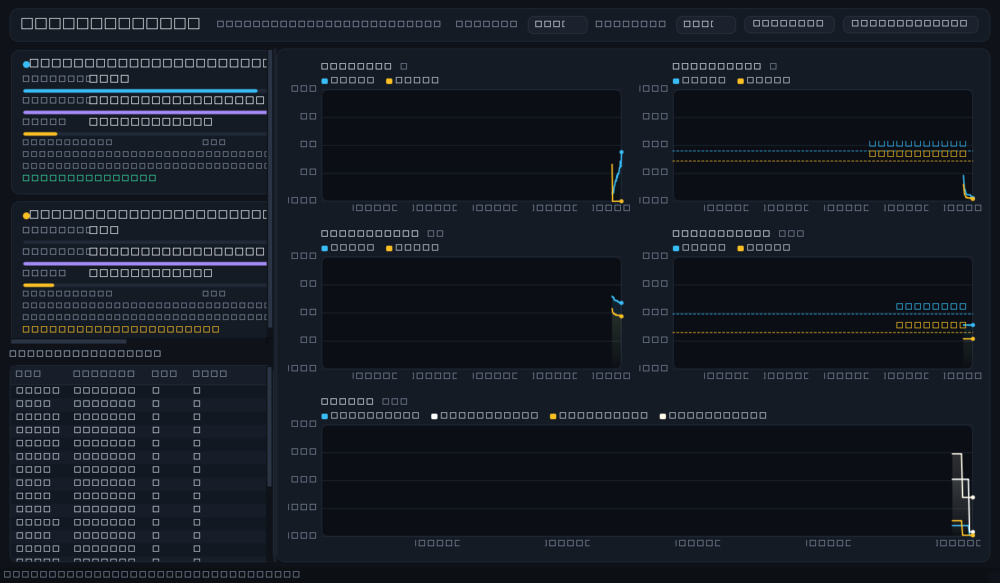

# GPU Monitor (PySide6 + nvidia-smi)

A modern, dark-themed live dashboard for one or more NVIDIA GPUs. It polls
`nvidia-smi` on a background thread and renders GPU load, power draw,
temperature, VRAM and clocks as interactive timeline charts — plus per-GPU
status cards and a live process table.



No external charting library is used: the timeline widget is a hand-rolled
`QPainter` implementation, so the only dependency is **PySide6**.

## Features

- **Timeline charts** (sliding window 1 min – 1 hour):
  - GPU load (%)
  - Power draw (W) with each card's **power limit** as a dashed reference line
  - Temperature (°C)
  - VRAM used (MiB) with each card's **memory total** as a reference line
  - Clocks (SM / memory, MHz)
  - Clickable legend (toggle any series), hover crosshair + tooltip,
    auto or fixed ("nice") Y scale
- **Per-GPU cards**: load / VRAM / power bars, temperature, fan,
  encoder/decoder utilization, SM·MEM·VID clocks, PCIe link, VBIOS, P-state,
  and decoded **throttle reasons** (power cap, thermal, fan, …)
- **Process table**: PID, process name, GPU, VRAM for everything holding a
  context on a GPU
- **Compact mode** (▭ Compact toggle): one vertical panel per GPU —
  name, P-state and throttle status on top, then GPU load, power,
  temperature, VRAM, fan speed, memory temperature, SM clock, memory clock
   and PCIe bus throughput stacked one below the other, each value above a
  small inline sparkline (30 px) that follows the chosen timeline window.
  No cards, charts or process table; the window shrinks to fit.
  Sparklines are seeded from the big charts' history, so the full timeline
  is visible the moment you switch. The top bar collapses to
  title + icon buttons
- **Stay on top** (📌 Top toggle): keeps the window above all others
- **Controls dialog** (☰ Controls): refresh interval (0.5–10 s),
  timeline window, **chart style** (filled area / plain line, applied to
  both the big timeline charts and the compact sparklines), pause/resume
  and **CSV export** of the full in-memory history — in a small non-modal
  dialog
- **State persistence**: window geometry, splitter sizes, refresh interval,
  timeline window, chart style, compact mode and always-on-top are saved
  to an INI file
  (`QSettings`, on Windows:
  `%APPDATA%\GPUMonitor\GPUMonitor.ini`) and restored on the next launch
- Multi-GPU aware; each GPU gets its own color across all charts and cards
- Read-only: no admin rights, no management commands

## Data sources

All values come from
`nvidia-smi --query-gpu=<fields> --format=csv,noheader,nounits` and
`--query-compute-apps=pid,process_name,used_memory,gpu_uuid`. Fields that a
given driver/OS can't report (e.g. `temperature.memory` on some consumer
cards) are shown as `—` instead of breaking. Driver and CUDA versions are
parsed from the `nvidia-smi` header (both the legacy `Driver Version`/
`CUDA Version` and the newer `KMD Version`/`CUDA UMD Version` layouts).

Queried fields: utilization (GPU/mem/enc/dec), temperature (GPU/mem),
memory (total/used/free), power (draw/limit/max/default), clocks
(graphics/SM/mem/video), fan speed, P-state, throttle-reason bitmask,
PCIe link gen/width, plus identity (name, UUID, bus id, VBIOS, serial,
driver version).

PCIe **Rx/Tx throughput** (the compact panels' "Bus (PCIe)" row, in MB/s)
cannot be requested via `--query-gpu` on this driver, so the app runs a
second, continuous `nvidia-smi dmon -s t -d 1` process for it (1 sample per
second, independent of the main refresh interval; paused together with the
main sampler). If `dmon` is unavailable on a given system the row simply
stays empty.

## Requirements

- Python 3.10+
- A working NVIDIA driver (`nvidia-smi` on `PATH` or in `System32`)
- `pip install -r requirements.txt`  (installs PySide6)

## Run

```bash
python main.py
```

## Project layout

```
main.py                  entry point
gpu_monitor/
  model.py               GpuSnapshot dataclass + throttle-bit decoding
  collector.py           nvidia-smi subprocess sampler (QThread) + parsing
  charts.py              TimeSeriesChart + Sparkline (custom QPainter)
  cards.py               GpuCard / GpuPanel / Bar widgets
  mainwindow.py          window layout, controls dialog, CSV export, INI state
  theme.py               dark Qt style sheet
docs/                    nvidia-smi reference docs + screenshot
```
